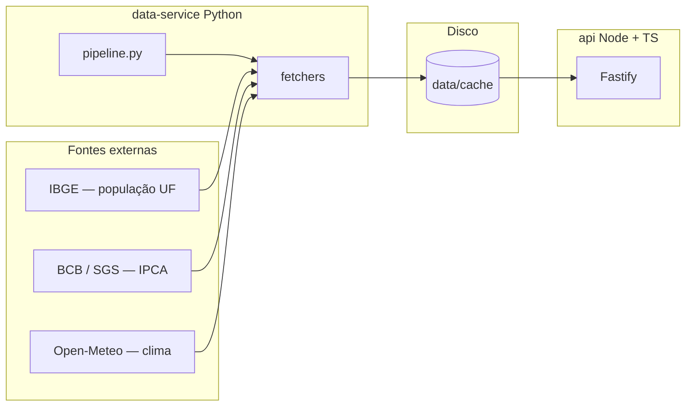

# Dados públicos BR — API

API REST em **Node.js + TypeScript** (Fastify) alimentada por um **pipeline Python** que busca, trata e grava cache JSON a partir de fontes públicas.

## Arquitetura



Fluxo resumido: o Python consulta as APIs, normaliza e grava arquivos em `data/cache/`. A API lê esses arquivos e responde em JSON (ou em HTML legível no navegador).

**Python:** recomendado **3.11 ou 3.12** (ecossistema com mais wheels prontos). Em **3.14** no Windows, evitamos **Pydantic** porque `pydantic-core` costuma exigir compilação (Rust + MSVC / `link.exe`). A validação no pipeline usa apenas a biblioteca padrão + `httpx` / `tenacity`.

## Fontes de dados

| Dado | Fonte |
|------|--------|
| População por UF | [IBGE — API de localidades e agregados (tabela 6579)](https://servicodados.ibge.gov.br/) |
| Inflação (IPCA mensal) | [BCB — SGS, série 433](https://www.bcb.gov.br/) |
| Clima atual | [Open-Meteo](https://open-meteo.com/) (sem chave; uso demonstrativo) |

## Clima e cidades

O clima **só existe para cidades mapeadas** em `data-service/fetchers/clima.py` (coordenadas fixas). O pipeline gera um arquivo `data/cache/clima_<slug>.json` por cidade listada no loop do `pipeline.py`. Para nova cidade: inclua no dicionário `CIDADES`, rode o pipeline de novo e chame `GET /clima/<slug>`.

## Como rodar

### 1. Pipeline (Python)

Na pasta `data-service`, com ambiente virtual ativo:

```bash
pip install -r requirements.txt
python pipeline.py
```

Isso cria/atualiza `data/cache/` (população, inflação, clima das cidades configuradas). Sem esse passo, rotas que dependem de cache podem responder **503**.

**dados.gov.br (etapa `gov`):** a API CKAN `package_search` costuma responder **401** sem token Bearer. O pipeline grava `gov_catalogo_amostra.json` com `amostra: []` e metadados de indisponibilidade em vez de falhar. Para pular só essa etapa: `python pipeline.py --skip gov`. Se tiver credencial do portal, exporte `DADOS_GOV_BR_TOKEN` antes de rodar o pipeline.

### 2. API (TypeScript)

Na pasta `api`:

```bash
npm install
npm run dev
```

Padrão: `http://127.0.0.1:3000`. Variáveis opcionais: `PORT`, `HOST`, `DATA_CACHE_DIR`, `CORS_ORIGINS` (veja [.env.example](./.env.example)).

### Build de produção

```bash
cd api && npm run build && npm start
```

### 3. Interface web (React + Tailwind)

Na pasta `web` (com a API já rodando na porta 3000):

```bash
npm install
npm run dev
```

Abre em `http://localhost:5173`. O Vite **proxifica** `/api/*` para `http://127.0.0.1:3000/*`, evitando CORS em desenvolvimento. A API aceita também origens `5173`/`4173` via `@fastify/cors`.

Build estático do front:

```bash
cd web && npm run build && npm run preview
```

Para apontar o front buildado para uma API remota, defina `VITE_API_URL` (sem barra no final) e inclua a origem do front em `CORS_ORIGINS` na API.

## Rotas úteis

Lista completa e arquivos em cache: **GET `/catalogo`**. Documentação interativa: **GET `/docs`**.

| Método | Rota | Descrição |
|--------|------|-----------|
| GET | `/` | Índice (HTML no navegador; JSON com `?format=json`) |
| GET | `/health` | Saúde do serviço |
| GET | `/catalogo` | Rotas + lista de JSON no cache |
| GET | `/populacao/estados` | UFs com população estimada (IBGE) |
| GET | `/populacao/municipios/:uf` | Municípios (arquivo `municipios_<uf>.json`) |
| GET | `/inflacao` | IPCA (paginação `?limit=&offset=`) |
| GET | `/economia/selic` | Selic (SGS 11) |
| GET | `/economia/cambio` | Câmbio USD (SGS 1) |
| GET | `/clima/:cidade` | Clima atual |
| GET | `/clima/:cidade/previsao` | Previsão 7 dias |
| GET | `/dados/gov-catalogo-amostra` | Amostra CKAN dados.gov.br |

No **navegador**, as respostas de dados usam página escura com JSON formatado. Para **JSON puro**: acrescente `?format=json` na URL.

## Licença dos dados

Respeite os termos de uso de cada fonte (IBGE, BCB, Open-Meteo). Este repositório é um exemplo educacional de integração, não um serviço oficial.
