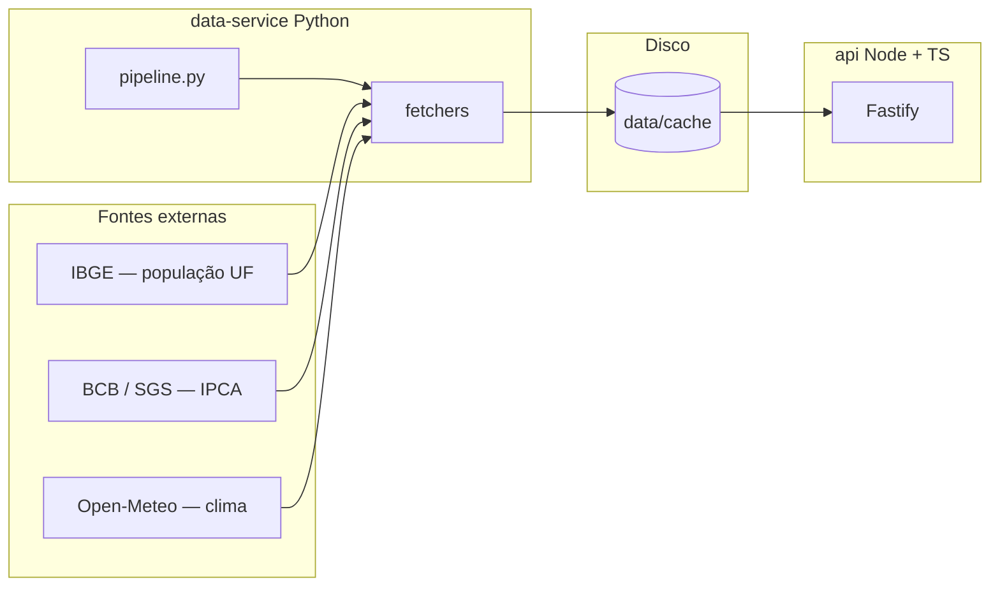

# Dados públicos BR — API

API REST em **Node.js + TypeScript** (Fastify) alimentada por um **pipeline Python** que busca, trata e grava cache JSON a partir de fontes públicas.

## Arquitetura



Fluxo resumido: o Python consulta as APIs, normaliza e grava arquivos em `data/cache/`. A API lê esses arquivos e responde em JSON (ou em HTML legível no navegador).

## Fontes de dados

| Dado | Fonte |
|------|--------|
| População por UF | [IBGE — API de localidades e agregados (tabela 6579)](https://servicodados.ibge.gov.br/) |
| Inflação (IPCA mensal) | [BCB — SGS, série 433](https://www.bcb.gov.br/) |
| Clima atual | [Open-Meteo](https://open-meteo.com/) (sem chave; uso demonstrativo) |

## Clima e cidades

O clima **só existe para cidades mapeadas** em `data-service/fetchers/clima.py` (coordenadas fixas). O pipeline gera um arquivo `data/cache/clima_<slug>.json` por cidade listada no loop do `pipeline.py`. Para nova cidade: inclua no dicionário `CIDADES`, rode o pipeline de novo e chame `GET /clima/<slug>`.

## Como rodar

### 1. Pipeline (Python)

Na pasta `data-service`, com ambiente virtual ativo:

```bash
pip install -r requirements.txt
python pipeline.py
```

Isso cria/atualiza `data/cache/` (população, inflação, clima das cidades configuradas). Sem esse passo, rotas que dependem de cache podem responder **503**.

### 2. API (TypeScript)

Na pasta `api`:

```bash
npm install
npm run dev
```

Padrão: `http://127.0.0.1:3000`. Variáveis opcionais: `PORT`, `HOST`.

### Build de produção

```bash
cd api && npm run build && npm start
```

## Rotas úteis

| Método | Rota | Descrição |
|--------|------|-----------|
| GET | `/` | Índice (HTML no navegador; JSON com `?format=json`) |
| GET | `/health` | Saúde do serviço |
| GET | `/populacao/estados` | UFs com população estimada (IBGE) |
| GET | `/inflacao` | Série IPCA mensal (BCB) |
| GET | `/clima/:cidade` | Clima se existir `clima_<slug>.json` no cache |

No **navegador**, as respostas de dados usam página escura com JSON formatado. Para **JSON puro**: acrescente `?format=json` na URL.

## Licença dos dados

Respeite os termos de uso de cada fonte (IBGE, BCB, Open-Meteo). Este repositório é um exemplo educacional de integração, não um serviço oficial.
